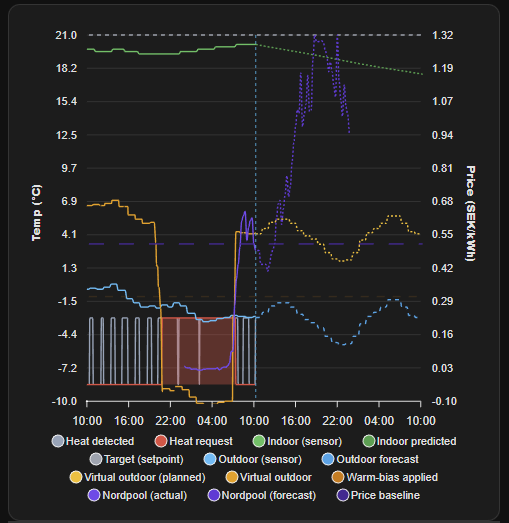
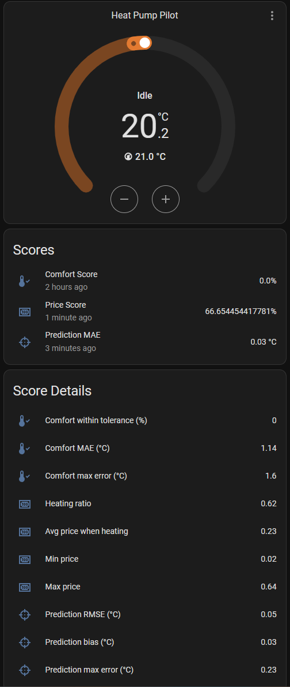

# Heat Pump Pilot

Heat Pump Pilot is a custom Home Assistant integration that runs a lightweight
MPC (model predictive control) loop to steer a heat pump through a "virtual
outdoor temperature" setpoint. It balances comfort vs electricity price and
continuously learns a simple thermal model of your home.

Instead of directly switching the compressor, Heat Pump Pilot writes a virtual
outdoor temperature to a `number.*` entity. For ground source heat pumps, this
virtual outdoor temperature shifts the heating curve (outdoor temperature to
supply temperature), and the pump's own integral-minutes logic decides when to
start or stop. Lower virtual outdoor temperatures request higher supply
temperatures (more heating), while higher virtual temperatures back off
heating.

Repository: https://github.com/andox/heat-pump-pilot

## Features
- MPC optimizer (binary on/off) with price vs comfort weighting.
- Virtual outdoor temperature control with price-aware warm bias.
- Two learning models: EKF (extended Kalman filter) or RLS (recursive least squares).
- Optional heating detection via supply/flow temperature sensor.
- Diagnostic sensors for decisions, health, learning state, price state, and scores.
- Comfort score, price score, and prediction accuracy metrics.
- Learning, price history, and performance history persist across restarts.

## Installation

### HACS (recommended)
1. Add this repository (`https://github.com/andox/heat-pump-pilot`) as a custom HACS integration.
2. Install "Heat Pump Pilot".
3. Restart Home Assistant.

### Manual
1. Copy `custom_components/heat_pump_pilot` into your Home Assistant
   `config/custom_components/` directory.
2. Restart Home Assistant.

## Configuration (UI)
Add the integration via **Settings > Devices & Services > Add Integration**.

Required entities:
- Indoor temperature sensor (`sensor.*`).
- Outdoor temperature sensor (`sensor.*`).
- Price sensor (`sensor.*`).

Optional entities:
- Controlled entity (the output target you want the integration to drive).
- Heating supply/flow temperature sensor for heating detection.

### Controlled entity types
Heat Pump Pilot will attempt to control different entity types:
- `number`: best for "virtual outdoor temperature" setpoints. Uses `number.set_value`.
- `switch`: on/off control.
- `climate`: sets target temperature and `hvac_mode`.
- Other domains: tries `set_temperature` or `turn_on/turn_off` if available.

### Monitor only mode
When **monitor_only** is enabled, Heat Pump Pilot will *not* call any control
services. It still computes decisions, forecasts, and diagnostics, but the heat
signal used for learning must come from a supply temperature sensor or a
controlled entity state (switch on / climate hvac_action == heating). If no
reliable heat signal exists, learning is disabled.

## Configuration options and defaults
Below are the main options exposed in the config/option flows, with defaults and
recommended values when you’re unsure. Values are in the UI unless noted.

Core control:
- Target temperature (default: 21.0°C): your comfort setpoint; set to your normal desired indoor temp.
- Price vs comfort weight (default: 0.5): 0.0 = comfort only, 1.0 = price only; common range is 0.7-0.95.
- Price penalty curve (default: linear): shapes how prices above the baseline are penalized (linear = proportional, sqrt = gentler, quadratic = stronger).
- Price baseline window (default: 24 h): how much recent observed history is used alongside forecasts when scaling prices (24/48/72 h).
- Absolute low-price threshold (default: auto): cap classification at `normal` when the current price is below the threshold (`auto` = median of recent history, `off` disables the cap).
- Absolute low-price auto window (default: 30 d): window used for the `auto` threshold (7/14/30 days).
- Continuous control enabled (default: true): smooths virtual outdoor temperature using MPC duty ratio.
- Continuous control window (default: 2 h): horizon used to compute the duty ratio (1–4 h).
- Control interval (default: 15 min): how often MPC runs; keep 15-30 min unless you have slow sensors.
- Prediction horizon (default: 24 h): MPC planning horizon; 12-24 h is typical.
- Comfort tolerance (default: 1.0°C): deadband before comfort penalty; 0.5-1.5°C is typical.
- Monitor only (default: false): true to disable control actions.

Virtual outdoor control:
- Virtual outdoor heat offset (default: 10.0°C): how much colder to request when heating; start at 6–12°C.
- Overshoot warm bias enabled (default: true): warm bias when predicted above target; also boosts MPC comfort penalty when above target.
- Overshoot warm bias curve (default: linear): shape of the back-off ramp; options are linear, quadratic, cubic, sqrt.
- Overshoot warm bias min/max: derived from the heat offset: min = 0, max = virtual_outdoor_heat_offset.
  - Curve shapes: linear = proportional ramp; quadratic/cubic = gentle early, stronger near full effect; sqrt = stronger early, gentler later.
- Overshoot warm bias hysteresis enabled (default: true): adds a deadband around the comfort tolerance to prevent on/off chatter.
- Overshoot warm bias hysteresis (default: 0.2°C): extra margin above/below the tolerance before the bias toggles.
- Virtual outdoor smoothing enabled (default: true): apply EMA smoothing to the output temperature.
- Virtual outdoor smoothing alpha (default: 0.5): 0–1; lower is smoother/slower, higher is more responsive.

Learning:
- Learning model (default: ekf): ekf is stable; rls can react faster to changes.
- RLS forgetting factor (default: 0.99): lower = faster adaptation; 0.97–0.995 is typical.
- Learning window (default: 12 h): history window used to decide stable vs learning; 12–24 h is a good balance.
- Thermal response seed (default: 0.5): initial guess for loss/gain; leave default unless you know your system.
- Base heat loss coefficient (default: 0.05): used until learning refines it; leave default in most cases.
- Initial indoor temp (default: unset): optional override; leave empty to use sensor value.
- Initial heat gain coefficient (default: unset): optional; leave empty unless you have a known value.
- Initial heat loss override (default: unset): optional; leave empty unless you have a known value.

Heating detection:
- Heating supply/flow temp entity (default: unset): optional but strongly recommended for better learning.
- Heating detection enabled (default: false unless a sensor is set).
- Supply temp threshold (default: 30°C): set to your pump’s “heating on” supply threshold.
- Supply temp hysteresis (default: 1.0°C): helps avoid chatter.
- Supply temp debounce (default: 60 s): helps avoid false positives on short spikes.
- Learning supply temp on/off margins (default: 1.0°C): extra buffer around the threshold for learning.

Performance metrics:
- Performance window (default: 24 h): 6/12/24/48/72/96 hours; 24–48 h is a good balance.

## Quick presets (starter values)
These are starting points; adjust after 1–2 days of data.

Comfort‑first:
- Price vs comfort weight: 0.70
- Price penalty curve: sqrt
- Comfort tolerance: 0.5–1.0°C
- Virtual outdoor heat offset: 3–6°C

Balanced:
- Price vs comfort weight: 0.85
- Price penalty curve: linear
- Comfort tolerance: 0.8–1.2°C
- Virtual outdoor heat offset: 4–8°C

Price‑first:
- Price vs comfort weight: 0.95
- Price penalty curve: quadratic
- Comfort tolerance: 1.0–1.5°C
- Virtual outdoor heat offset: 6–10°C

## Virtual outdoor temperature
The integration computes a "virtual outdoor" temperature and applies it to the
controlled entity. The mapping is:
- If heating is requested: `virtual = outdoor - virtual_heat_offset`.
- If idle: `virtual = outdoor + warm_bias`, where warm_bias depends on price and
  (optionally) indoor overshoot. Warm bias is capped by `virtual_heat_offset`.
- A hard cap of 25C prevents pushing the pump into summer/no-heat mode.
When **continuous control** is enabled, the controller smooths the virtual
outdoor temperature based on the planned duty ratio over a short window. A
ratio of 0 maps to `outdoor + virtual_heat_offset`, while 1 maps to
`outdoor - virtual_heat_offset`, with price/overshoot warm-bias blended in.
When overshoot warm bias is enabled, the MPC comfort penalty becomes asymmetric:
above-target errors are penalized more strongly once indoor temperature exceeds
the comfort tolerance. The warm-bias back-off ramps from a minimum of `0` to a
maximum of `virtual_outdoor_heat_offset`,
using the selected curve (linear/quadratic/cubic/sqrt). Below-target penalties
are unchanged.
This acts as a back-off when indoor temperature is above target by pushing the
virtual outdoor higher so the pump is less likely to heat.
When overshoot hysteresis is enabled, the back-off only activates once the
indoor temperature exceeds `comfort_tolerance + hysteresis`, and it stays active
until the temperature drops below `comfort_tolerance - hysteresis`.
When virtual outdoor smoothing is enabled, the output is EMA-smoothed between
control runs; use a lower alpha for smoother, slower changes.

### Creating an outdoor temperature sensor from a weather entity
If you only have a `weather.*` entity, create a template sensor:

```yaml
template:
  - sensor:
      - name: "Outdoor Temperature"
        unit_of_measurement: "C"
        state: "{{ state_attr('weather.home', 'temperature') }}"
```

Use this sensor as the outdoor temperature entity, and use the `weather.home`
entity for forecasts.

## Learning (thermal model)
Heat Pump Pilot learns two coefficients:
- **heat_loss_coeff**: how fast the home leaks heat to the outdoors.
- **heat_gain_coeff**: how much heating raises indoor temperature.

Learning requires a "heat on" signal:
- **Preferred**: heating supply/flow temperature sensor with threshold, hysteresis,
  and debounce. The signal is only used when the supply temperature is clearly
  on/off (outside the on/off margins).
- **Fallback (controlling mode)**: assume the last applied MPC decision is the
  heat signal.
- **Fallback (monitor-only mode)**: use controlled entity state if it clearly
  indicates heating (switch on or climate hvac_action == heating).

If no reliable heat signal exists, the estimator only tracks indoor temperature
and does *not* update the coefficients.

### EKF model (default)
The EKF state is `[indoor_temp, heat_loss_coeff, heat_gain_coeff]`.
At each step:
1. Predict the next temperature using the current coefficients.
2. Compute the innovation from the measured temperature.
3. Update the coefficients and covariance, with process/measurement noise.
4. Clamp coefficients to safe ranges.

### RLS model
The RLS model estimates `[heat_gain_coeff, heat_loss_coeff]` from the change in
temperature:
- Uses a forgetting factor (0.90 to 1.00, default 0.99).
- Updates on each sample using `dT = measured - last_temp`.
- Decouples cross-covariance when heating is off to avoid gain drift.
- Clamps coefficients to safe ranges.

### Learning state
Learning state uses a rolling window of model history (default 12 h):
- If the relative change in loss and gain stays under 5%, the model is **stable**.
- Otherwise, it is **learning**.
- If no heat signal is available, learning is **disabled**.

## Price baseline and classification
The integration uses a single baseline for both MPC and classification:
- **Unified baseline**: median of `price_forecast + price_history_window`, where
  `price_history_window` is the last 24/48/72 hours of observed prices.
  Non-positive prices are ignored and a small floor is used to avoid skew.
The window length is controlled by **Price baseline window** in the options flow.
Classification can also apply an **Absolute low-price threshold**. When set, any
current price at or below the threshold will never classify above `normal`.
Set it to `auto` to use the median of the configured history window (7/14/30 days),
or `off` to disable the hybrid cap.
On a fresh install, the `auto` threshold may be `None` until enough history is
available; the cap is disabled until the history builds.

Price-aware penalties only apply when `price_ratio > 1.0` (current price above baseline).
The ratio is capped (default `3.0`) before applying the curve, and all curves are
monotonic, so higher prices never reduce the penalty. The curve works alongside
`price_comfort_weight`: higher weight magnifies the curve's impact on optimization.
If you want gentle shifts, use `sqrt`; for aggressive avoidance of spikes, use
`quadratic`; `linear` is a balanced default.

Classification uses `ratio = current_price / baseline` with labels:
- `< 0.75` -> `very_low`
- `< 0.90` -> `low`
- `< 1.10` -> `normal`
- `< 1.30` -> `high`
- `< 1.60` -> `very_high`
- `>= 1.60` -> `extreme`

## Performance metrics
Performance is computed over a configurable window (6/12/24/48/72/96 hours):
- **Comfort score**: percent of samples within comfort tolerance.
- **Price score**: how often heating occurs during low prices
  (based on average price while heating vs min/max prices).
- **Prediction accuracy**: MAE/RMSE/bias from MPC temperature predictions.

These metrics are persisted and survive restarts.

## Early-run behavior (history builds)
Some features depend on stored history and will be less informative on day one:
- **Absolute low-price threshold (auto)**: needs up to the configured window (7/14/30 days) of price history.
- **Price/comfort/accuracy scores**: need enough performance samples to be meaningful.
- **Learning state / curve recommendation**: require samples from the learning window.
These stabilize after 1–2 days of operation, and continue to improve with more data.

## Persistence and restart behavior
The integration stores its state in `.storage`:
- `heat_pump_pilot_<entry_id>_thermal.json` (learning model + history)
- `heat_pump_pilot_<entry_id>_prices.json` (price history, up to ~30 days)
- `heat_pump_pilot_<entry_id>_performance.json` (performance samples)

This means learning, price baselines, and performance scores survive restarts.

## Sensors and diagnostics
Key diagnostic sensors:
- Heat Pump Pilot Decision: last MPC action plus forecast/plan details, including:
  `overshoot_warm_bias_enabled`, `overshoot_warm_bias_curve`,
  `overshoot_warm_bias_min_bias`, `overshoot_warm_bias_max_bias`,
  `overshoot_warm_bias_applied`, and `overshoot_warm_bias_multiplier`.
  Large arrays (price history/forecast, outdoor forecast, planned temps) are capped
  to the most recent 192 entries to stay under recorder limits.
- Heat Pump Pilot Health: overall health with reasons (missing sensors, stale control, etc).
- Curve recommendation (Health attribute): suggests when to raise/lower the heat pump curve
  based on heating detected during idle vs requested heating over the performance window.
- Heat Pump Pilot Control State: whether the integration is controlling or monitoring.
- Heat Pump Pilot Learning State: learning vs stable, with change ratios and window stats.
- Heat Pump Pilot Price State: current price classification and baseline details.
- Heat Pump Pilot Virtual Outdoor: the current virtual outdoor temperature sent to the pump.
- Heat Pump Pilot Virtual Outdoor Trace: rolling history of recent virtual outdoor decisions
  (see the `trace` attribute for detailed entries).
- Heat Pump Pilot Comfort Score: percent of samples within comfort tolerance.
- Heat Pump Pilot Price Score: how well heating aligns with low prices.
- Heat Pump Pilot Prediction Accuracy: MAE plus RMSE/bias for predicted indoor temperature.
- Heat Pump Pilot Heating Detected (binary): debounced heating detection from supply sensor.

## Dashboard card (example)
This grid card is safe to paste into a Lovelace dashboard.

Notes about entities:
- From this integration: `climate.heat_pump_pilot`, `sensor.heat_pump_pilot_*`,
  `binary_sensor.heat_pump_pilot_heating_detected`.
- From your own setup: `sensor.ground_source_heat_pump` (supply/flow temperature). If you
  don’t have one, remove that line from the Temperatures graph.

```yaml
square: false
type: grid
columns: 1
cards:
  - type: thermostat
    entity: climate.heat_pump_pilot
    name: Heat Pump Pilot
    show_current_as_primary: true
  - type: entities
    title: Scores
    entities:
      - entity: sensor.heat_pump_pilot_comfort_score
        name: Comfort Score
        secondary_info: last-changed
      - entity: sensor.heat_pump_pilot_price_score
        name: Price Score
        secondary_info: last-changed
      - entity: sensor.heat_pump_pilot_prediction_accuracy
        name: Prediction MAE
        secondary_info: last-changed
    show_header_toggle: false
    state_color: false
  - type: entities
    title: Score Details
    show_header_toggle: false
    entities:
      - type: attribute
        entity: sensor.heat_pump_pilot_comfort_score
        attribute: within_tolerance_pct
        name: Comfort within tolerance (%)
      - type: attribute
        entity: sensor.heat_pump_pilot_comfort_score
        attribute: mean_abs_error
        name: Comfort MAE (°C)
      - type: attribute
        entity: sensor.heat_pump_pilot_comfort_score
        attribute: max_abs_error
        name: Comfort max error (°C)
      - type: attribute
        entity: sensor.heat_pump_pilot_price_score
        attribute: heating_ratio
        name: Heating ratio
      - type: attribute
        entity: sensor.heat_pump_pilot_price_score
        attribute: avg_price_when_heating
        name: Avg price when heating
      - type: attribute
        entity: sensor.heat_pump_pilot_price_score
        attribute: min_price
        name: Min price
      - type: attribute
        entity: sensor.heat_pump_pilot_price_score
        attribute: max_price
        name: Max price
      - type: attribute
        entity: sensor.heat_pump_pilot_prediction_accuracy
        attribute: rmse
        name: Prediction RMSE (°C)
      - type: attribute
        entity: sensor.heat_pump_pilot_prediction_accuracy
        attribute: bias
        name: Prediction bias (°C)
      - type: attribute
        entity: sensor.heat_pump_pilot_prediction_accuracy
        attribute: max_abs_error
        name: Prediction max error (°C)
  - type: history-graph
    title: Temperatures
    hours_to_show: 24
    entities:
      - entity: sensor.heat_pump_pilot_virtual_outdoor
        name: Virtual Outdoor
      - entity: sensor.ground_source_heat_pump
        name: Supply Temp
      - entity: climate.heat_pump_pilot
        name: Pilot
  - type: entities
    title: Diagnostics
    entities:
      - entity: sensor.heat_pump_pilot_decision
        secondary_info: last-changed
      - entity: sensor.heat_pump_pilot_health
        secondary_info: last-changed
      - type: attribute
        entity: sensor.heat_pump_pilot_health
        attribute: curve_recommendation
        name: Curve recommendation
      - entity: sensor.heat_pump_pilot_virtual_outdoor_trace
        name: Virtual outdoor trace
      - entity: sensor.heat_pump_pilot_control_state
        secondary_info: last-changed
      - entity: sensor.heat_pump_pilot_learning_state
        secondary_info: last-changed
      - entity: sensor.heat_pump_pilot_price_state
        secondary_info: last-changed
      - type: attribute
        entity: sensor.heat_pump_pilot_decision
        attribute: price_absolute_low_threshold
        name: Price low threshold
      - type: attribute
        entity: sensor.heat_pump_pilot_decision
        attribute: price_absolute_low_threshold_kind
        name: Price low threshold kind
      - entity: binary_sensor.heat_pump_pilot_heating_detected
        secondary_info: last-changed
    show_header_toggle: false
    state_color: true
  - type: entities
    title: Curve Recommendation Details
    show_header_toggle: false
    entities:
      - type: attribute
        entity: sensor.heat_pump_pilot_health
        attribute: curve_recommendation_details
        name: Curve recommendation details
  - type: entities
    title: Model Estimates
    show_header_toggle: false
    entities:
      - type: attribute
        entity: climate.heat_pump_pilot
        attribute: estimated_heat_loss_coefficient
        name: Estimated heat loss
      - type: attribute
        entity: climate.heat_pump_pilot
        attribute: estimated_heat_gain_coefficient
        name: Estimated heat gain
      - type: attribute
        entity: climate.heat_pump_pilot
        attribute: estimated_indoor_temperature
        name: Estimated indoor temp
  - type: entities
    title: Learning Details
    show_header_toggle: false
    entities:
      - type: attribute
        entity: sensor.heat_pump_pilot_learning_state
        attribute: samples
        name: Samples (window)
      - type: attribute
        entity: sensor.heat_pump_pilot_learning_state
        attribute: window_hours
        name: Window (hours)
      - type: attribute
        entity: sensor.heat_pump_pilot_learning_state
        attribute: loss_change_ratio
        name: Loss change ratio
      - type: attribute
        entity: sensor.heat_pump_pilot_learning_state
        attribute: gain_change_ratio
        name: Gain change ratio
      - type: attribute
        entity: sensor.heat_pump_pilot_learning_state
        attribute: first_sample_time
        name: First sample time
      - type: attribute
        entity: sensor.heat_pump_pilot_learning_state
        attribute: last_sample_time
        name: Last sample time
      - type: attribute
        entity: sensor.heat_pump_pilot_decision
        attribute: heating_duty_cycle_ratio
        name: Heating duty cycle ratio
      - type: attribute
        entity: sensor.heat_pump_pilot_decision
        attribute: continuous_control_duty_ratio
        name: Continuous duty ratio
      - type: attribute
        entity: sensor.heat_pump_pilot_decision
        attribute: overshoot_warm_bias_applied
        name: Back-off applied (°C)
      - type: attribute
        entity: sensor.heat_pump_pilot_decision
        attribute: overshoot_warm_bias_curve
        name: Back-off curve
      - type: attribute
        entity: sensor.heat_pump_pilot_decision
        attribute: overshoot_warm_bias_min_bias
        name: Back-off min (°C)
      - type: attribute
        entity: sensor.heat_pump_pilot_decision
        attribute: overshoot_warm_bias_max_bias
        name: Back-off max (°C)
```

## ApexCharts overview (example)
This ApexCharts card shows indoor/virtual/outdoor temperatures alongside Nordpool prices.
Replace entity IDs with your own sensors/entities (indoor temp, outdoor temp, Nordpool, etc.).

```yaml
type: custom:apexcharts-card
header:
  title: Heat Pump Pilot — Overview
  show_states: true
  colorize_states: true
graph_span: 48h
span:
  start: hour
  offset: "-24h"
now:
  show: true
all_series_config:
  extend_to: now
apex_config:
  grid:
    show: true
    strokeDashArray: 0.11
  chart:
    height: 500
    animations:
      enabled: false
  stroke:
    width: 1.4
    curve: smooth
  markers:
    size: 0
  tooltip:
    shared: true
    intersect: false
  legend:
    show: true
    position: bottom
    fontSize: 11px
    itemMargin:
      horizontal: 10
      vertical: 2
yaxis:
  - id: temp
    min: -10
    decimals: 1
    apex_config:
      title:
        text: Temp (°C)
  - id: outdoor
    show: false
    min: -10
    max: 25
    decimals: 1
  - id: virt
    show: false
    min: -10
    max: 25
    decimals: 1
  - id: price
    opposite: true
    min: -0.1
    decimals: 2
    apex_config:
      title:
        text: Price (SEK/kWh)
  - id: binary
    opposite: true
    show: false
    min: -0.05
    max: 1.05
    decimals: 0
series:
  - name: Heat detected
    entity: binary_sensor.heat_pump_pilot_heating_detected
    type: area
    yaxis_id: binary
    color: "#94A3B8"
    stroke_width: 1
    curve: stepline
    opacity: 0.012
    group_by:
      duration: 5min
      func: max
    transform: "return (x === 'on' || x === true) ? 0.2 : 0;"
    show:
      legend_value: false
  - name: Heat request
    entity: sensor.heat_pump_pilot_decision
    type: area
    yaxis_id: binary
    color: "#EF4444"
    stroke_width: 1
    curve: stepline
    opacity: 0.35
    group_by:
      duration: 5min
      func: max
    transform: "return (x === 'heat_on') ? 0.2 : 0;"
    show:
      legend_value: false
  - name: Indoor (sensor)
    entity: sensor.sonoff_snzb_02d_temperature
    type: line
    yaxis_id: temp
    color: "#22C55E"
    group_by:
      duration: 15min
      func: avg
    show:
      in_header: true
      legend_value: false
  - name: Indoor predicted
    entity: sensor.heat_pump_pilot_decision
    type: line
    yaxis_id: temp
    color: "#16A34A"
    stroke_dash: 2
    stroke_width: 1
    extend_to: false
    show:
      legend_value: false
    data_generator: >
      const d = entity?.attributes || {}; const arr = d.predicted_temperatures
      || []; const t0 = Date.parse(d.last_control_time || ""); const dt = 15 *
      60 * 1000; if (!t0 || !arr.length) return []; const cutoff = Date.now() -
      dt; return arr
        .map((v, i) => [t0 + i * dt, Number(v)])
        .filter(p => Number.isFinite(p[1]) && p[0] >= cutoff);
  - name: Target (setpoint)
    entity: climate.heat_pump_pilot
    type: line
    yaxis_id: temp
    color: "#9CA3AF"
    stroke_width: 1
    stroke_dash: 4
    extend_to: false
    show:
      legend_value: false
    data_generator: >
      const t = Number(entity?.attributes?.temperature); if
      (!Number.isFinite(t)) return []; const now = Date.now(); return [[now - 24
      * 60 * 60 * 1000, t], [now + 24 * 60 * 60 * 1000, t]];
  - name: Outdoor (sensor)
    entity: sensor.outdoor_temperature
    type: line
    yaxis_id: outdoor
    color: "#38BDF8"
    stroke_width: 1
    group_by:
      duration: 15min
      func: avg
    show:
      in_header: true
      legend_value: false
  - name: Outdoor forecast
    entity: sensor.heat_pump_pilot_decision
    type: line
    yaxis_id: outdoor
    color: "#0EA5E9"
    stroke_width: 2
    stroke_dash: 4
    extend_to: false
    show:
      legend_value: false
    data_generator: >
      const d = entity?.attributes || {}; const arr = d.outdoor_forecast || [];
      const t0 = Date.parse(d.last_control_time || ""); const dt = 15 * 60 *
      1000; if (!t0 || !arr.length) return []; const cutoff = Date.now() - dt;
      return arr
        .map((v, i) => [t0 + i * dt, Number(v)])
        .filter(p => Number.isFinite(p[1]) && p[0] >= cutoff);
  - name: Virtual outdoor (planned)
    entity: sensor.heat_pump_pilot_decision
    type: line
    yaxis_id: virt
    color: "#FBBF24"
    stroke_width: 1
    stroke_dash: 2
    curve: stepline
    extend_to: false
    show:
      legend_value: false
    data_generator: >
      const d = entity?.attributes || {}; const arr =
      d.planned_virtual_outdoor_temperatures || []; const t0 =
      Date.parse(d.last_control_time || ""); const dt = 15 * 60 * 1000; if (!t0
      || !arr.length) return []; const cutoff = Date.now() - dt; return arr
        .map((v, i) => [t0 + i * dt, Number(v)])
        .filter(p => Number.isFinite(p[1]) && p[0] >= cutoff);
  - name: Virtual outdoor
    entity: sensor.heat_pump_pilot_virtual_outdoor
    type: line
    yaxis_id: virt
    color: "#F59E0B"
    stroke_width: 2
    curve: stepline
    show:
      in_header: true
      legend_value: false
  - name: Warm-bias applied
    entity: sensor.heat_pump_pilot_decision
    type: line
    yaxis_id: virt
    color: "#D97706"
    stroke_dash: 8
    stroke_width: 1
    opacity: 0.15
    extend_to: false
    show:
      legend_value: false
    data_generator: >
      const applied = Number(entity?.attributes?.overshoot_warm_bias_applied);
      if (!Number.isFinite(applied)) return []; const now = Date.now(); return
      [[now - 24 * 60 * 60 * 1000, applied], [now + 24 * 60 * 60 * 1000,
      applied]];
  - name: Nordpool (actual)
    entity: sensor.nordpool_kwh_se3_sek_3_10_025
    type: line
    yaxis_id: price
    color: "#7C3AED"
    stroke_width: 1.2
    curve: stepline
    extend_to: now
    show:
      in_header: true
      legend_value: false
    data_generator: >
      const now = Date.now(); const a = entity?.attributes || {}; const today =
      Array.isArray(a.raw_today) ? a.raw_today : []; const tomorrow =
      Array.isArray(a.raw_tomorrow) ? a.raw_tomorrow : []; return [...today,
      ...tomorrow]
        .filter(p => p && p.start && p.value !== undefined)
        .map(p => [new Date(p.start).getTime(), Number(p.value)])
        .filter(p => Number.isFinite(p[1]) && p[0] <= now);
  - name: Nordpool (forecast)
    entity: sensor.nordpool_kwh_se3_sek_3_10_025
    type: line
    yaxis_id: price
    color: "#6D28D9"
    stroke_width: 1
    stroke_dash: 2
    curve: stepline
    extend_to: false
    show:
      legend_value: false
    data_generator: >
      const now = Date.now(); const a = entity?.attributes || {}; const today =
      Array.isArray(a.raw_today) ? a.raw_today : []; const tomorrow =
      Array.isArray(a.raw_tomorrow) ? a.raw_tomorrow : []; return [...today,
      ...tomorrow]
        .filter(p => p && p.start && p.value !== undefined)
        .map(p => [new Date(p.start).getTime(), Number(p.value)])
        .filter(p => Number.isFinite(p[1]) && p[0] >= now);
  - name: Price baseline
    entity: sensor.heat_pump_pilot_decision
    type: line
    yaxis_id: price
    color: "#4C1D95"
    stroke_width: 1
    stroke_dash: 15
    extend_to: false
    show:
      legend_value: false
    data_generator: >
      const b = Number(entity?.attributes?.price_baseline); if
      (!Number.isFinite(b)) return []; const now = Date.now(); return [[now - 24
      * 60 * 60 * 1000, b], [now + 24 * 60 * 60 * 1000, b]];
```

## Screenshots
<table>
  <tr>
    <td align="center">
      
    </td>
    <td align="center">
      
    </td>
  </tr>
</table>

## Tests
Tests live under `tests/`:
- `test_forecast_utils.py`
- `test_learning_utils.py`
- `test_mpc_controller.py`
- `test_notification_utils.py`
- `test_performance_utils.py`
- `test_thermal_model.py`
- `test_virtual_outdoor_utils.py`

Run with:
```bash
pytest
```

## Adding another learning model
To add a new learning model:
1. Implement a new estimator in `thermal_model.py` with `step()`,
   `observe_temperature()`, `export_state()`, and `restore()`.
2. Add a new `LEARNING_MODEL_*` constant and config option.
3. Update `_build_thermal_model()` in `climate.py` to instantiate it.
4. Ensure persistence includes a `model_type` field and add tests.
5. Update the config flow and strings for the new option.

## Notes and limitations
- In monitor-only mode without a reliable heat signal, learning is disabled.
- Heating detection via supply/flow sensor improves learning quality and speed.
- Weather forecast data is optional but improves prediction accuracy; the weather entity itself
  is still required in the config flow.
