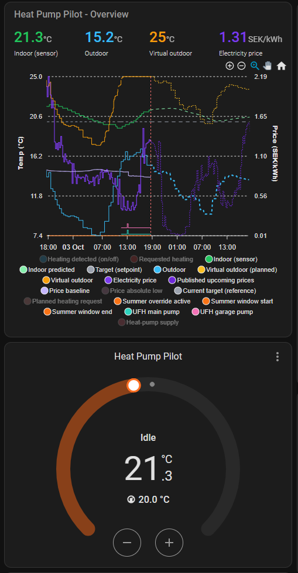
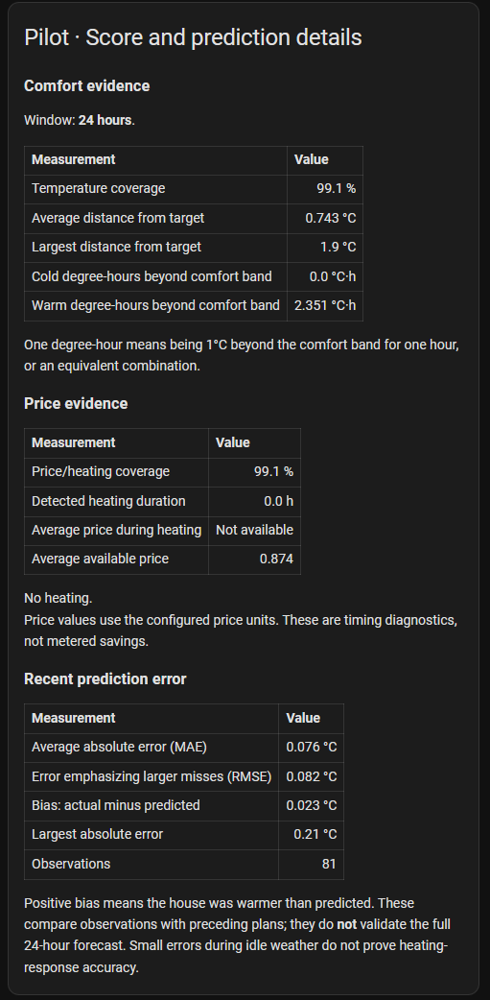

# Heat Pump Pilot

Heat Pump Pilot is a custom Home Assistant integration that runs a lightweight
MPC (model predictive control) loop to steer a heat pump through a "virtual
outdoor temperature" setpoint. It balances comfort vs electricity price and
continuously learns a simple thermal model of your home.

Instead of directly switching the compressor, Heat Pump Pilot writes a virtual
outdoor temperature to a `number.*` entity. For ground source heat pumps, this
virtual outdoor temperature shifts the heating curve (outdoor temperature to
supply temperature), and the pump's own integral-minutes logic decides when to
start or stop. Lower virtual outdoor temperatures request higher supply
temperatures (more heating), while higher virtual temperatures back off
heating.

Repository: https://github.com/andox/heat-pump-pilot

## Features
- MPC optimizer with price vs comfort weighting and optional learned pump delay.
- Virtual outdoor temperature control with price-aware warm bias.
- Hourly adaptive house learning with heat loss, heating gain and background warmth; legacy EKF/RLS remain available.
- Optional heating detection via supply/flow temperature sensor.
- Diagnostic sensors for decisions, health, learning state, price state, and scores.
- Comfort score, price score, and prediction accuracy metrics.
- Learning, price history, and performance history persist across restarts.

## Installation

### HACS (recommended)
1. Add this repository (`https://github.com/andox/heat-pump-pilot`) as a custom HACS integration.
2. Install "Heat Pump Pilot".
3. Restart Home Assistant.

### Manual
1. Copy `custom_components/heat_pump_pilot` into your Home Assistant
   `config/custom_components/` directory.
2. Restart Home Assistant.

## Configuration (UI)
Add the integration via **Settings > Devices & Services > Add Integration**.

Required entities:
- Indoor temperature sensor (`sensor.*`).
- Outdoor temperature sensor (`sensor.*`).
- Price sensor (`sensor.*`).

Optional entities:
- Controlled entity (the output target you want the integration to drive).
- Heating supply/flow temperature sensor for heating detection.

### Controlled entity types
Heat Pump Pilot will attempt to control different entity types:
- `number`: best for "virtual outdoor temperature" setpoints. Uses `number.set_value`.
- `switch`: on/off control.
- `climate`: sets target temperature and `hvac_mode`.
- Other domains: tries `set_temperature` or `turn_on/turn_off` if available.

### Monitor only mode
When **monitor_only** is enabled, Heat Pump Pilot will *not* call any control
services. It still computes decisions, forecasts, and diagnostics, but the heat
signal used for learning must come from a supply temperature sensor or a
controlled entity state (switch on / climate hvac_action == heating). If no
reliable heat signal exists, learning is disabled.

Everyday comfort settings appear first, followed by **Sensors and heat pump**.
Advanced settings are in collapsed groups at the bottom: control, prices,
learning, detection, initial estimates and diagnostics. Existing
options retain their original storage keys.

## Configuration options and defaults
Below are the main options exposed in the config/option flows, with defaults and
recommended values when you’re unsure. Values are in the UI unless noted.

Core control:
- Target temperature (default: 21.0°C): your comfort setpoint; set to your normal desired indoor temp.
- Price priority (default: 0.5): 0.0 = comfort only, 1.0 = price only; common range is 0.4-0.6.
- Price penalty curve (default: linear): shapes how prices above the baseline are penalized (linear = proportional, sqrt = gentler, quadratic = stronger).
- Price baseline window (default: 24 h): how much timestamped observed history
  is used alongside known future prices when scaling prices (24/48/72 h).
  The median includes zero and negative prices; the normalization baseline has
  a positive floor of 0.01 in the configured price units.
- Absolute low-price threshold (default: auto): cap classification at `normal` when the current price is below the threshold (`auto` = median of recent history, `off` disables the cap).
- Absolute low-price auto window (default: 30 d): window used for the `auto` threshold (7/14/30 days).

Price forecasts with timestamps are sampled at the actual MPC timestamps,
including 15-minute, hourly and daylight-saving transitions. Missing periods
stay missing in baseline calculations. For planning only, Pilot holds the last
known price (or the current sensor price before the first known interval).
The decision sensor exposes known/total forecast steps and the fallback policy.
Untimed legacy `prices`/`forecast` lists use an hourly convention; timestamped
data is preferred because its interval is unambiguous.

Price history stores dated 15-minute buckets and excludes data outside the
requested time window. Recorder backfill holds each valid state for at most
one hour, ending earlier at the next state change, including unavailable states.
Older saved history without timestamps is rebuilt from Recorder after an update;
until then, the baseline uses available forecast/new observations. This does not
reset learned house coefficients.

Further control options:
- Continuous control enabled (default: true): plans request strength and actual virtual-temperature commands directly for number outputs at the normal 15-minute interval.
- Continuous control window (legacy binary modes only, default: 2 h): duty averaging horizon (1–4 h). Hidden when the command-aware planner is selected; learned and unlearned delivery models both choose requests directly.
- Summer low-price heat window (default: off): optionally schedules one daily
  continuous heat window during low-demand periods when every price sample in
  the window is at or below the configured absolute max price.
- Summer heat window max price (default: 0.30): absolute price cap for the
  whole summer heat window.
- Summer heat window duration (default: 60 min): required continuous duration;
  the run is never split across multiple low-price periods.
- Summer heat demand history window/max recent demand ratio (default: 48 h / 10%): automatic
  season gate based on recent normal MPC heat-request ratio, without calendar
  dates.
- Summer heat virtual outdoor offset (default: same as normal virtual
  outdoor heat offset): virtual outdoor reduction used only when the summer
  window overrides idle.
- Control interval (default: 15 min): how often MPC runs; keep 15-30 min unless you have slow sensors.
- Prediction horizon (default: 24 h): MPC planning horizon; 12-24 h is typical.
- Comfort tolerance (default: 1.0°C): deadband before comfort penalty; 0.5-1.5°C is typical.
- Monitor only (default: false): true to disable control actions.

Virtual outdoor control:
- Virtual outdoor heat offset (default: 10.0°C): max shift colder when heating and warmer when backing off; start at 6–12°C.
- Virtual outdoor minimum (default: -15.0°C): never send a lower virtual outdoor temperature unless the actual outdoor temperature is already below this.
- Separate overshoot warm-bias controls are retired. Saved values remain compatible, but do not alter the new planner or live output.
- Virtual outdoor smoothing enabled (default: true): apply EMA smoothing to the output temperature.
- Output responsiveness / smoothing alpha (default: 0.5): 0–1 per normal control interval; lower is smoother/slower, higher is more responsive. Existing alpha settings retain their meaning at the normal cadence.

Learning:
- Learning model (new-install default: adaptive): jointly learns loss, heating gain and background warmth. Existing explicit EKF/RLS selections are retained.
- Learning interval (default: 60 min, range: 30–120): independent of the control interval.
- House learning history (default: 72 h, range: 24–168): rolling adaptive fitting window.
- Learn delayed pump response (default: enabled): learns from actual number states and measured heating. Planning requires validation, identifiable house gain, continuous control and a 15-minute control interval.
- RLS forgetting factor (default: 0.99): lower = faster adaptation; 0.97–0.995 is typical.
- Learning window (default: 12 h): legacy EKF/RLS stability diagnostic, separate from the adaptive fitting window.
- Thermal response seed (default: 0.5): initial guess for loss/gain; leave default unless you know your system.
- Base heat loss coefficient (default: 0.05): used until learning refines it; leave default in most cases.
- Initial indoor temp (default: unset): optional override; leave empty to use sensor value.
- Initial heat gain coefficient (default: unset): optional; leave empty unless you have a known value.
- Initial heat loss override (default: unset): optional; leave empty unless you have a known value.

Heating detection:
- Heating supply/flow temp entity (default: unset): optional but strongly recommended for better learning.
- Heating detection enabled (default: false unless a sensor is set).
- Supply temp threshold (default: 30°C): set to your pump’s “heating on” supply threshold.
- Supply temp hysteresis (default: 1.0°C): helps avoid chatter.
- Supply temp debounce (default: 60 s): helps avoid false positives on short spikes.
- Learning supply temp on/off margins (default: 1.0°C): extra buffer around the threshold for learning.

Performance metrics:
- Performance window (default: 24 h): 6/12/24/48/72/96 hours; 24–48 h is a good balance.

## Quick presets (starter values)
These are starting points; adjust after 1–2 days of data.

Comfort‑first:
- Price priority: 0.30
- Price penalty curve: sqrt
- Comfort tolerance: 0.5–1.0°C
- Virtual outdoor heat offset: 3–6°C

Balanced:
- Price priority: 0.50
- Price penalty curve: linear
- Comfort tolerance: 0.8–1.2°C
- Virtual outdoor heat offset: 4–8°C

Price‑first:
- Price priority: 0.70
- Price penalty curve: quadratic
- Comfort tolerance: 1.0–1.5°C
- Virtual outdoor heat offset: 6–10°C

## Planning comfort, preheating and coasting

The existing target and comfort tolerance define a symmetric planning band:
`lower = target - tolerance`, `upper = target + tolerance`. For target 20.5 C
and tolerance 1.2 C, the allowed predicted range is 19.3 to 21.7 C. A larger
range permits both deeper coasting and more preheating; it does not require
heating to the upper limit.

MPC first minimizes predicted temperature excursions outside that band, then
uses **Price vs Comfort** to choose between equally feasible plans. It still
runs at the existing control cadence. A high price weight favors cheaper heating
and coasting inside the band; a low weight prefers staying close to target.
0.5 weights the normalized terms equally, not equal real-world discomfort and
currency. High prices alone cannot buy a breach when the search finds a plan
that stays inside the band. This changes the meaning of tolerance from a soft
penalty deadband to a planning boundary; existing values are not changed.

Normal virtual-temperature control includes the actual output bounds, rounding,
EMA smoothing and, when validated, the learned delivery delay/residual heating.
Until learning is ready, the same planner uses an explicitly unlearned immediate
proportional delivery estimate. This fallback cannot know an old pump's integral;
its predicted comfort band is not a guarantee of actual room temperature.

Backoff and preheating are outcomes of the same optimization. There is no extra
warm-bias rule or request hold/ramp rewriting the command-aware planner's first
action. A small command-change cost discourages needless reversals, and elapsed-
time output smoothing remains. Legacy nonstandard binary modes retain their
request limiter. Independent summer heating remains an explicit override.

The diagnostic fields `planning_model` (`learned`, `fallback`, or `binary`),
`planned_comfort_status`, `planned_comfort_violation_degree_hours`, and
`comfort_lower_bound` / `comfort_upper_bound` expose the result. A
`predicted_breach` means the selected plan crosses a boundary, including passive
warming above it or insufficient predicted capacity. The bounded search does
not prove global physical infeasibility; it reports a forecast, not a guarantee.

See [the design and behavioral test contracts](docs/comfort_planning.md).

## Virtual outdoor temperature

For request strength `u` from 0 to 1, the mapping is
`virtual = outdoor + offset * (1 - 2*u)`: zero requests maximum warm backoff,
one requests maximum heating, and 0.5 is neutral. The virtual-temperature
minimum, 25 C maximum, and controlled entity bounds/rounding still apply.
The planner sends its exact first predicted command. It learns from measured
heating, never assuming that requested idle instantly stops the compressor.

Smoothing uses elapsed time:
`effective_alpha = 1 - (1 - alpha) ** (elapsed / control_interval)`.
Extra sensor updates do not accelerate smoothing. Alpha 1 disables output
smoothing; the enable switch is retained for existing configurations. No new
user settings are introduced, and Price vs Comfort remains available.

### Summer low-price heat window
The optional summer heat window is intended for periods where normal space
heating demand is already low, but you still want one low-price daily heat pulse to
put warmth into a hydronic floor. It does not use calendar dates. Instead, it
checks the recent normal MPC heat-request ratio; with the default settings it is
eligible only when the last 48 hours requested heat no more than 10% of the
time.

When eligible, the controller searches the remaining local day for one
continuous price block where every sample is at or below the configured max
price. The block must cover the configured duration, defaults to 60 minutes,
and if several blocks qualify the cheapest average block is selected. If no
qualifying continuous block exists in the currently available price forecast,
the feature reports `skipped` but re-checks on later control runs. This handles
Nordpool-style next-day prices arriving later in the day. It never splits one
daily run across multiple sessions, and once a window has started or completed
it will not schedule another run for the same local day.

During the selected window, normal MPC still runs first. If the MPC already
requests heat, the window is counted without adding another behaviour. If the
MPC is idle, the summer window overrides idle by lowering the virtual outdoor
temperature using the dedicated **Summer heat virtual outdoor offset**,
which requests more heat from the heat pump. This lets the summer heat pulse use
a stronger trigger than normal MPC heating if the pump needs a colder virtual
outdoor value to start floor heating. The result is still constrained by the
global virtual outdoor minimum. In monitor-only mode, the schedule and
diagnostics are still computed, but no control service is called.

### Creating an outdoor temperature sensor from a weather entity
If you only have a `weather.*` entity, create a template sensor:

```yaml
template:
  - sensor:
      - name: "Outdoor Temperature"
        unit_of_measurement: "C"
        state: "{{ state_attr('weather.home', 'temperature') }}"
```

Use this sensor as the outdoor temperature entity, and use the `weather.home`
entity for forecasts.

## Learning (thermal model)
The default control interval remains **15 minutes**, with existing sensor-triggered
runs. A separate one-minute observation timer and sensor events collect evidence;
they do not run MPC. Coefficients update only after a complete learning interval,
normally **60 minutes**.

Intervals pair indoor temperature change with time-weighted outdoor temperature
and heating during the same period. At least 95% coverage is required. Unknown
states, runtime gaps over five minutes and temperature jumps above 2°C/hour are
excluded. Partial intervals are discarded after restart. Unchanged readings are
held; this cannot detect a sensor that silently stops reporting.

All models need measured heating: supply/flow temperature with threshold,
hysteresis, debounce and on/off margins, or the controlled switch/climate state.
A virtual outdoor request is **not** evidence of heating. With a `number.*`
output, configure a heating detection sensor. Without a usable signal, the
coefficients stay unchanged. Supply temperature remains a proxy affected by
sensor placement and domestic-hot-water cycles.

### Adaptive house model

```text
indoor change per hour = loss × (outdoor − indoor) + gain × measured heating + background
```

The three terms are fitted together. Background represents unexplained net
warmth/cooling, such as solar or household gains, and is included in MPC
forecasts. It is not a separately measured physical source.

Fitting needs 24 usable hours and changing indoor/outdoor temperature differences.
Gain remains frozen unless there are three equivalent heating hours, three
coasting hours, and heating variation independent of outdoor temperature. Summer
history therefore cannot reliably identify winter heating capacity. Existing
loss/gain bounds (0.001–0.25 and 0.1–1.5) remain; background is bounded at
±0.5°C/hour. Parameter changes are also limited per elapsed hour.

For an existing installation, select **Options → Advanced: learning → Learning
model → adaptive**. Learned loss/gain values carry over; changing an initial
estimate explicitly reseeds them. Background starts at zero when entering
adaptive mode. New installations default to adaptive. Sensor or detector changes
discard the associated observation history.

### Delayed pump response

A separate model learns request strength, idle heating, delay (0–120 minutes)
and response smoothing from complete 15-minute averages of the actual controlled
number state and the debounced measured heating detector. Unlike house learning,
it does not require indoor temperature or apply the extra supply-temperature
learning margins. This preserves measured start/stop transitions during short
heating cycles and prevents sunshine at the indoor sensor from interrupting pump
learning. Missing pump, outdoor or request observations still fail coverage
checks; gaps are never filled with invented heating.

Initial fitting requires at least 28 hours of retained observations, with enough
continuous stretches, heating, coasting and varying requests. It fits at most
hourly on up to 288 quarter-hour observations; gaps split those observations
into separate stretches.

The same learner also tests a small outdoor-temperature correction, without an
additional configuration setting. Its target heating fraction is
`clip(idle + request_gain * delayed_request + outdoor_gain * (reference - outdoor) / 10, 0, 1)`.
The reference is the training period's mean outdoor temperature. The additional
coefficient is constrained to 0–0.5 heating fraction per 10°C colder; it cannot
make colder weather reduce heating or reverse the effect of a stronger request.
This models the observed effect of the heat pump's curve, not its exact curve
settings or measured thermal output. Outdoor temperature acts on the current
interval's response target; request delay and response smoothing remain separate.

The outdoor correction requires complete outdoor history, at least 4°C variation
in training, and at least 1°C residual standard deviation after accounting for
request strength at every candidate delay. It must improve held-out heating MAE
by both 10% and 0.01 heating fraction compared with the existing delayed model,
as well as pass the baseline checks below. Otherwise the existing delayed model
remains the candidate. Forecast outdoor temperatures are clamped to the training
range for this correction, so mild-weather observations are not extrapolated
into unobserved winter conditions. The ordinary house heat-loss calculation
still uses the actual forecast temperature.

Saved pump observations now include their interval-average outdoor temperature.
Older observations are retained for the simpler fit with outdoor marked unknown;
they are not assigned invented temperatures. Restarts retain observations and
fitted coefficients. Gaps split the evidence into separate stretches: fitting,
lag selection and validation never bridge unknown time. A new completed interval
triggers revalidation against the retained evidence. MPC additionally waits for
fresh measured heating and request history covering the learned delay (at least
15 minutes, up to two hours); restarting does not require rebuilding the entire
28-hour training history. Recent operating state and partial intervals are not
restored as if the pump had been observed while Home Assistant was offline. The decision sensor's `pump_response` attributes expose
`outdoor_active`, `outdoor_reason`, `outdoor_gain_per_10c`, `outdoor_range_c` and
both candidate validation errors. `outdoor_active` means the learner accepted
the correction; `pump_response_planning_active` separately indicates whether
the latest MPC plan actually used response learning.

Delay is selected on training observations. The following 16 observations must show
at least 10% lower heating prediction error than both direct-request and
constant-duty baselines. When the baseline error is below 0.02 heating fraction,
the period cannot validate a new response. An already validated response is
retained unchanged if its error on those observations is also at most 0.02. When heating resumes, the saved response can remain usable if it beats the same recent-validation baselines by at least 10%, even before the training window has enough heating to fit a replacement. Contradictory observations revoke that trust.
This allows long coasting periods without discarding a useful delay model.
Incompatible observations suspend that trust. The validation marker is saved
with the coefficients; restarts still require fresh measured state, and older
snapshots without the marker must pass normal validation first.

Restarts and gaps suspend live state until enough fresh evidence is available.
The command-aware planner uses the immediate proportional fallback when response
planning is unavailable. When using the adaptive house model,
its heating gain must also be identifiable before response planning activates.

When eligible, MPC chooses 0/25/50/75/100% requested duty and simulates delayed
heating, output limits and smoothing. The price penalty follows predicted
heating, including heating that continues after a request stops. The first duty
is applied directly; forecasts are replayed after the current output is limited.
Future hysteresis and unexpected sensor-triggered decisions are approximations;
subsequent control runs replan using observations. Optimization runs outside
Home Assistant's event loop.

Heating runtime is a price-cost proxy. This does not measure electrical power,
COP or guaranteed electricity savings.

### Legacy EKF and RLS

Existing selections remain supported with the same complete learning intervals.
EKF updates temperature/loss/gain covariance; RLS estimates loss/gain with its
forgetting factor. Neither adds background warmth. Noise/forgetting settings
apply per coefficient update, so hourly updates adapt more slowly than repeated
updates on every sensor-triggered control run.

### Learning diagnostics

Climate and Decision attributes expose `learning_details`, `pump_response` and
`pump_response_planning_active`. Climate also exposes `estimated_background_gain`;
Decision exposes planned duty and predicted heating. Adaptive `fit_status`
distinguishes insufficient history, insufficient weather variation, frozen gain
and learning. Frozen coefficients are not evidence of convergence. Legacy models
retain their rolling 5% loss/gain stability indicator.

See [the offline replay tool](tools/README.md) for comparisons using exported
Home Assistant history.

## Price baseline and classification
The integration uses a single baseline for both MPC and classification:
- **Unified baseline**: median of `price_forecast + price_history_window`, where
  `price_history_window` is the last 24/48/72 hours of observed prices.
  Non-positive prices are ignored and a small floor is used to avoid skew.
The window length is controlled by **Price baseline window** in the options flow.
Classification can also apply an **Absolute low-price threshold**. When set, any
current price at or below the threshold will never classify above `normal`.
Set it to `auto` to use the median of the configured history window (7/14/30 days),
or `off` to disable the hybrid cap.
On a fresh install, the `auto` threshold may be `None` until enough history is
available; the cap is disabled until the history builds.

Price-aware penalties only apply when `price_ratio > 1.0` (current price above baseline).
The ratio is capped (default `3.0`) before applying the curve, and all curves are
monotonic, so higher prices never reduce the penalty. The curve works alongside
`price_comfort_weight`: higher weight magnifies the curve's impact on optimization.
If you want gentle shifts, use `sqrt`; for aggressive avoidance of spikes, use
`quadratic`; `linear` is a balanced default.

Classification uses `ratio = current_price / baseline` with labels:
- `< 0.75` -> `very_low`
- `< 0.90` -> `low`
- `< 1.10` -> `normal`
- `< 1.30` -> `high`
- `< 1.60` -> `very_high`
- `>= 1.60` -> `extreme`

## Performance metrics
Performance is computed over a configurable window (6/12/24/48/72/96 hours):
- **Comfort score**: percent of samples within comfort tolerance.
- **Price score**: how often heating occurs during low prices
  (based on average price while heating vs min/max prices).
- **Prediction accuracy**: MAE/RMSE/bias from MPC temperature predictions.

These metrics are persisted and survive restarts.

## Early-run behavior (history builds)
Some features depend on stored history and will be less informative on day one:
- **Absolute low-price threshold (auto)**: needs up to the configured window (7/14/30 days) of price history.
- **Price/comfort/accuracy scores**: need enough performance samples to be meaningful.
- **Learning state / curve recommendation**: require samples from the learning window.
These stabilize after 1–2 days of operation, and continue to improve with more data.

## Persistence and restart behavior
The integration stores its state in `.storage`:
- `heat_pump_pilot_<entry_id>_thermal.json` (learning model + history)
- `heat_pump_pilot_<entry_id>_prices.json` (price history, up to ~30 days)
- `heat_pump_pilot_<entry_id>_performance.json` (performance samples)
- `heat_pump_pilot_<entry_id>_summer_heat_window.json` (selected daily heat window)

This means learning, price baselines, performance scores, and the selected daily
summer heat window survive restarts.

## Sensors and diagnostics
The existing **Sensor inputs** persistent notification warns when indoor,
outdoor or heating-detection supply temperature has not reported for more than
24 hours. It uses Home Assistant's `last_reported` timestamp (falling back to
`last_updated` on older versions), so repeated reports of an unchanged temperature
remain fresh. Missing or unavailable inputs are also reported; issues must persist
for five minutes, after a two-minute startup grace, before a notification appears.
The warning clears when valid reports resume. This notification threshold does
not change the separate, configurable UFH pump safety freshness limit.

Key diagnostic sensors:
- Heat Pump Pilot Decision: last MPC action plus forecast/plan details, including:
  `overshoot_warm_bias_enabled`, `overshoot_warm_bias_curve`,
  `overshoot_warm_bias_min_bias`, `overshoot_warm_bias_max_bias`,
  `overshoot_warm_bias_applied`, and `overshoot_warm_bias_multiplier`.
  In continuous mode, `suggested_heat_on` is the raw first binary MPC step for
  compatibility; use `effective_requested_duty_ratio`,
  `effective_heat_request_state`, `anti_chatter_limited`, and
  `raw_mpc_sequence_head` to understand the actual applied request.
  Large arrays (price history/forecast, outdoor forecast, planned temps) are capped
  to the most recent 192 entries to stay under recorder limits.
- Heat Pump Pilot Health: overall health with reasons (missing sensors, stale control, etc).
- Curve recommendation (Health attribute): suggests when to raise/lower the heat pump curve
  based on heating detected during low requested heat vs active requested heat over the
  performance window. In continuous mode this uses requested duty ratio (not only on/off),
  so small non-zero preheating is not treated as true idle.
- Heat Pump Pilot Control State: whether the integration is controlling or monitoring.
- Heat Pump Pilot Learning State: learning vs stable, with change ratios and window stats.
- Heat Pump Pilot Price State: current price classification and baseline details.
- Heat Pump Pilot Virtual Outdoor: the current virtual outdoor temperature sent to the pump.
- Heat Pump Pilot Virtual Outdoor Trace: rolling history of recent virtual outdoor decisions
  (see the `trace` attribute for detailed entries).
- Heat Pump Pilot Comfort Score: percent of covered time within target ± comfort
  tolerance. Attributes separate `too_cold_pct` and `too_warm_pct`, and quantify
  discomfort beyond the band in cold/warm degree-hours. A warm house can score
  poorly even with heating off; this measures comfort, not who caused the error.
- Heat Pump Pilot Price Score: heating timing on a 0–100 scale. 50 means heating
  at the average observed price; 100 means the cheapest possible allocation of
  the same heating duration, and 0 the most expensive. Unknown heating periods
  are excluded. No heating, no idle comparison, or constant prices produce an
  unknown score with an explanatory `reason` attribute.
- Heat Pump Pilot Prediction Accuracy: MAE plus RMSE/bias for predicted indoor temperature.
- Heat Pump Pilot Heating Detected (binary): debounced heating detection from supply sensor.

Comfort and price scores weight observations by elapsed time, capped at one
configured control interval per observation. Additional updates do not receive
extra weight, and long gaps are not filled. `covered_hours` and `coverage_pct`
show how much of the selected performance window was usable. They remain
estimates from control-loop observations, so short heating cycles can be missed.
Comfort uses each observation's target and the current configured tolerance.

The price score is a timing diagnostic, **not measured electricity or money
saved**. It assumes equal heating power and compares theoretical schedules that
may not satisfy the house's thermal constraints. The
`price_advantage_per_kwh_proxy` attribute is average available price minus
average price during detected heating; it is not a metered saving. Price scores
from this method (`equal_runtime_price_opportunity_v2`) are not directly
comparable to older scores based on the minimum/maximum price alone.

## Dashboard card (example)
This grid card is safe to paste into a Lovelace dashboard.

Notes about entities:
- From this integration: `climate.heat_pump_pilot`, `sensor.heat_pump_pilot_*`,
  `binary_sensor.heat_pump_pilot_heating_detected`.
- From your own setup: `sensor.ground_source_heat_pump` (supply/flow temperature). If you
  don’t have one, remove that line from the Temperatures graph.

```yaml
square: false
type: grid
columns: 1
cards:
  - type: thermostat
    entity: climate.heat_pump_pilot
    name: Heat Pump Pilot
    show_current_as_primary: true
  - type: entities
    title: Scores
    entities:
      - entity: sensor.heat_pump_pilot_comfort_score
        name: Comfort Score
        secondary_info: last-changed
      - entity: sensor.heat_pump_pilot_price_score
        name: Price Score
        secondary_info: last-changed
      - entity: sensor.heat_pump_pilot_prediction_accuracy
        name: Prediction MAE
        secondary_info: last-changed
    show_header_toggle: false
    state_color: false
  - type: entities
    title: Score Details
    show_header_toggle: false
    entities:
      - type: attribute
        entity: sensor.heat_pump_pilot_comfort_score
        attribute: within_tolerance_pct
        name: Comfort within tolerance (%)
      - type: attribute
        entity: sensor.heat_pump_pilot_comfort_score
        attribute: mean_abs_error
        name: Comfort MAE (°C)
      - type: attribute
        entity: sensor.heat_pump_pilot_comfort_score
        attribute: max_abs_error
        name: Comfort max error (°C)
      - type: attribute
        entity: sensor.heat_pump_pilot_price_score
        attribute: heating_ratio
        name: Heating ratio
      - type: attribute
        entity: sensor.heat_pump_pilot_price_score
        attribute: avg_price_when_heating
        name: Avg price when heating
      - type: attribute
        entity: sensor.heat_pump_pilot_price_score
        attribute: min_price
        name: Min price
      - type: attribute
        entity: sensor.heat_pump_pilot_price_score
        attribute: max_price
        name: Max price
      - type: attribute
        entity: sensor.heat_pump_pilot_prediction_accuracy
        attribute: rmse
        name: Prediction RMSE (°C)
      - type: attribute
        entity: sensor.heat_pump_pilot_prediction_accuracy
        attribute: bias
        name: Prediction bias (°C)
      - type: attribute
        entity: sensor.heat_pump_pilot_prediction_accuracy
        attribute: max_abs_error
        name: Prediction max error (°C)
  - type: history-graph
    title: Temperatures
    hours_to_show: 24
    entities:
      - entity: sensor.heat_pump_pilot_virtual_outdoor
        name: Virtual Outdoor
      - entity: sensor.ground_source_heat_pump
        name: Supply Temp
      - entity: climate.heat_pump_pilot
        name: Pilot
  - type: entities
    title: Diagnostics
    entities:
      - entity: sensor.heat_pump_pilot_decision
        secondary_info: last-changed
      - entity: sensor.heat_pump_pilot_health
        secondary_info: last-changed
      - type: attribute
        entity: sensor.heat_pump_pilot_health
        attribute: curve_recommendation
        name: Curve recommendation
      - entity: sensor.heat_pump_pilot_virtual_outdoor_trace
        name: Virtual outdoor trace
      - entity: sensor.heat_pump_pilot_control_state
        secondary_info: last-changed
      - entity: sensor.heat_pump_pilot_learning_state
        secondary_info: last-changed
      - entity: sensor.heat_pump_pilot_price_state
        secondary_info: last-changed
      - type: attribute
        entity: sensor.heat_pump_pilot_decision
        attribute: price_absolute_low_threshold
        name: Price low threshold
      - type: attribute
        entity: sensor.heat_pump_pilot_decision
        attribute: price_absolute_low_threshold_kind
        name: Price low threshold kind
      - entity: binary_sensor.heat_pump_pilot_heating_detected
        secondary_info: last-changed
    show_header_toggle: false
    state_color: true
  - type: entities
    title: Curve Recommendation Details
    show_header_toggle: false
    entities:
      - type: attribute
        entity: sensor.heat_pump_pilot_health
        attribute: curve_recommendation_details
        name: Curve recommendation details
  - type: entities
    title: Model Estimates
    show_header_toggle: false
    entities:
      - type: attribute
        entity: climate.heat_pump_pilot
        attribute: estimated_heat_loss_coefficient
        name: Estimated heat loss
      - type: attribute
        entity: climate.heat_pump_pilot
        attribute: estimated_heat_gain_coefficient
        name: Estimated heat gain
      - type: attribute
        entity: climate.heat_pump_pilot
        attribute: estimated_indoor_temperature
        name: Estimated indoor temp
  - type: entities
    title: Learning Details
    show_header_toggle: false
    entities:
      - type: attribute
        entity: sensor.heat_pump_pilot_learning_state
        attribute: samples
        name: Samples (window)
      - type: attribute
        entity: sensor.heat_pump_pilot_learning_state
        attribute: window_hours
        name: Window (hours)
      - type: attribute
        entity: sensor.heat_pump_pilot_learning_state
        attribute: loss_change_ratio
        name: Loss change ratio
      - type: attribute
        entity: sensor.heat_pump_pilot_learning_state
        attribute: gain_change_ratio
        name: Gain change ratio
      - type: attribute
        entity: sensor.heat_pump_pilot_learning_state
        attribute: first_sample_time
        name: First sample time
      - type: attribute
        entity: sensor.heat_pump_pilot_learning_state
        attribute: last_sample_time
        name: Last sample time
      - type: attribute
        entity: sensor.heat_pump_pilot_decision
        attribute: heating_duty_cycle_ratio
        name: Heating duty cycle ratio
      - type: attribute
        entity: sensor.heat_pump_pilot_decision
        attribute: continuous_control_duty_ratio
        name: Continuous duty ratio
      - type: attribute
        entity: sensor.heat_pump_pilot_decision
        attribute: overshoot_warm_bias_applied
        name: Back-off applied (°C)
      - type: attribute
        entity: sensor.heat_pump_pilot_decision
        attribute: overshoot_warm_bias_curve
        name: Back-off curve
      - type: attribute
        entity: sensor.heat_pump_pilot_decision
        attribute: overshoot_warm_bias_min_bias
        name: Back-off min (°C)
      - type: attribute
        entity: sensor.heat_pump_pilot_decision
        attribute: overshoot_warm_bias_max_bias
        name: Back-off max (°C)
```

## ApexCharts overview (continuous-control example)
This ApexCharts card shows indoor/virtual/outdoor temperatures alongside Nordpool prices.
It is tuned for the current integration behavior where `suggested_heat_on` is the raw
first MPC step, while `effective_requested_duty_ratio` is the actual effective request
used to drive virtual outdoor control in continuous mode.
Replace entity IDs with your own sensors/entities (indoor temp, outdoor temp, Nordpool, etc.).

```yaml
type: custom:apexcharts-card
header:
  title: Heat Pump Pilot — Overview
  show_states: true
  colorize_states: true
graph_span: 48h
span:
  start: hour
  offset: "-24h"
now:
  show: true
all_series_config:
  extend_to: now
apex_config:
  grid:
    show: true
    strokeDashArray: 0.11
  chart:
    height: 500
    animations:
      enabled: false
  stroke:
    width: 1.4
    curve: smooth
  markers:
    size: 0
  tooltip:
    shared: true
    intersect: false
  legend:
    show: true
    position: bottom
    fontSize: 11px
    itemMargin:
      horizontal: 10
      vertical: 2
yaxis:
  - id: temp
    min: -10
    decimals: 1
    apex_config:
      title:
        text: Temp (°C)
  - id: outdoor
    show: false
    min: -10
    max: 25
    decimals: 1
  - id: virt
    show: false
    min: -10
    max: 25
    decimals: 1
  - id: price
    opposite: true
    min: -0.1
    decimals: 2
    apex_config:
      title:
        text: Price (SEK/kWh)
  - id: binary
    opposite: true
    show: false
    min: -0.05
    max: 1.05
    decimals: 2
    apex_config:
      title:
        text: Request / Heat
series:
  - name: Heat detected
    entity: binary_sensor.heat_pump_pilot_heating_detected
    type: area
    yaxis_id: binary
    color: "#94A3B8"
    stroke_width: 1
    curve: stepline
    opacity: 0.14
    group_by:
      duration: 5min
      func: max
    transform: "return (x === 'on' || x === true) ? 1 : 0;"
    show:
      legend_value: false
  - name: Requested duty ratio
    entity: sensor.heat_pump_pilot_decision
    attribute: effective_requested_duty_ratio
    type: area
    yaxis_id: binary
    color: "#EF4444"
    stroke_width: 1
    curve: stepline
    opacity: 0.28
    group_by:
      duration: 5min
      func: max
    transform: "return Number.isFinite(Number(x)) ? Number(x) : null;"
    show:
      legend_value: false
  - name: Raw MPC first step
    entity: sensor.heat_pump_pilot_decision
    type: line
    yaxis_id: binary
    color: "#F87171"
    stroke_width: 1
    curve: stepline
    stroke_dash: 4
    group_by:
      duration: 5min
      func: max
    transform: "return (x === 'heat_on') ? 1 : 0;"
    show:
      legend_value: false
  - name: Anti-chatter limited
    entity: sensor.heat_pump_pilot_decision
    attribute: anti_chatter_limited
    type: line
    yaxis_id: binary
    color: "#FB7185"
    stroke_width: 1
    stroke_dash: 2
    curve: stepline
    group_by:
      duration: 5min
      func: max
    transform: "return (x === true || x === 'true') ? 0.08 : 0;"
    show:
      legend_value: false
  - name: Indoor (sensor)
    entity: sensor.sonoff_snzb_02d_temperature
    type: line
    yaxis_id: temp
    color: "#22C55E"
    group_by:
      duration: 15min
      func: avg
    show:
      in_header: true
      legend_value: false
  - name: Indoor predicted
    entity: sensor.heat_pump_pilot_decision
    type: line
    yaxis_id: temp
    color: "#16A34A"
    stroke_dash: 2
    stroke_width: 1
    extend_to: false
    show:
      legend_value: false
    data_generator: >
      const d = entity?.attributes || {}; const arr = d.predicted_temperatures
      || []; const t0 = Date.parse(d.last_control_time || ""); const dt = 15 *
      60 * 1000; if (!t0 || !arr.length) return []; const cutoff = Date.now() -
      dt; return arr
        .map((v, i) => [t0 + i * dt, Number(v)])
        .filter(p => Number.isFinite(p[1]) && p[0] >= cutoff);
  - name: Target (setpoint)
    entity: climate.heat_pump_pilot
    type: line
    yaxis_id: temp
    color: "#9CA3AF"
    stroke_width: 1
    stroke_dash: 4
    extend_to: false
    show:
      legend_value: false
    data_generator: >
      const t = Number(entity?.attributes?.temperature); if
      (!Number.isFinite(t)) return []; const now = Date.now(); return [[now - 24
      * 60 * 60 * 1000, t], [now + 24 * 60 * 60 * 1000, t]];
  - name: Outdoor (sensor)
    entity: sensor.outdoor_temperature
    type: line
    yaxis_id: outdoor
    color: "#38BDF8"
    stroke_width: 1
    group_by:
      duration: 15min
      func: avg
    show:
      in_header: true
      legend_value: false
  - name: Outdoor forecast
    entity: sensor.heat_pump_pilot_decision
    type: line
    yaxis_id: outdoor
    color: "#0EA5E9"
    stroke_width: 2
    stroke_dash: 4
    extend_to: false
    show:
      legend_value: false
    data_generator: >
      const d = entity?.attributes || {}; const arr = d.outdoor_forecast || [];
      const t0 = Date.parse(d.last_control_time || ""); const dt = 15 * 60 *
      1000; if (!t0 || !arr.length) return []; const cutoff = Date.now() - dt;
      return arr
        .map((v, i) => [t0 + i * dt, Number(v)])
        .filter(p => Number.isFinite(p[1]) && p[0] >= cutoff);
  - name: Virtual outdoor (planned)
    entity: sensor.heat_pump_pilot_decision
    type: line
    yaxis_id: virt
    color: "#FBBF24"
    stroke_width: 1
    stroke_dash: 2
    curve: stepline
    extend_to: false
    show:
      legend_value: false
    data_generator: >
      const d = entity?.attributes || {}; const arr =
      d.planned_virtual_outdoor_temperatures || []; const t0 =
      Date.parse(d.last_control_time || ""); const dt = 15 * 60 * 1000; if (!t0
      || !arr.length) return []; const cutoff = Date.now() - dt; return arr
        .map((v, i) => [t0 + i * dt, Number(v)])
        .filter(p => Number.isFinite(p[1]) && p[0] >= cutoff);
  - name: Virtual outdoor
    entity: sensor.heat_pump_pilot_virtual_outdoor
    type: line
    yaxis_id: virt
    color: "#F59E0B"
    stroke_width: 2
    curve: stepline
    show:
      in_header: true
      legend_value: false
  - name: Warm-bias applied
    entity: sensor.heat_pump_pilot_decision
    type: line
    yaxis_id: virt
    color: "#D97706"
    stroke_dash: 8
    stroke_width: 1
    opacity: 0.15
    extend_to: false
    show:
      legend_value: false
    data_generator: >
      const applied = Number(entity?.attributes?.overshoot_warm_bias_applied);
      if (!Number.isFinite(applied)) return []; const now = Date.now(); return
      [[now - 24 * 60 * 60 * 1000, applied], [now + 24 * 60 * 60 * 1000,
      applied]];
  - name: Nordpool (actual)
    entity: sensor.nordpool_kwh_se3_sek_3_10_025
    type: line
    yaxis_id: price
    color: "#7C3AED"
    stroke_width: 1.2
    curve: stepline
    extend_to: now
    show:
      in_header: true
      legend_value: false
    data_generator: >
      const now = Date.now(); const a = entity?.attributes || {}; const today =
      Array.isArray(a.raw_today) ? a.raw_today : []; const tomorrow =
      Array.isArray(a.raw_tomorrow) ? a.raw_tomorrow : []; return [...today,
      ...tomorrow]
        .filter(p => p && p.start && p.value !== undefined)
        .map(p => [new Date(p.start).getTime(), Number(p.value)])
        .filter(p => Number.isFinite(p[1]) && p[0] <= now);
  - name: Nordpool (forecast)
    entity: sensor.nordpool_kwh_se3_sek_3_10_025
    type: line
    yaxis_id: price
    color: "#6D28D9"
    stroke_width: 1
    stroke_dash: 2
    curve: stepline
    extend_to: false
    show:
      legend_value: false
    data_generator: >
      const now = Date.now(); const a = entity?.attributes || {}; const today =
      Array.isArray(a.raw_today) ? a.raw_today : []; const tomorrow =
      Array.isArray(a.raw_tomorrow) ? a.raw_tomorrow : []; return [...today,
      ...tomorrow]
        .filter(p => p && p.start && p.value !== undefined)
        .map(p => [new Date(p.start).getTime(), Number(p.value)])
        .filter(p => Number.isFinite(p[1]) && p[0] >= now);
  - name: Price baseline
    entity: sensor.heat_pump_pilot_decision
    type: line
    yaxis_id: price
    color: "#4C1D95"
    stroke_width: 1
    stroke_dash: 15
    extend_to: false
    show:
      legend_value: false
    data_generator: >
      const b = Number(entity?.attributes?.price_baseline); if
      (!Number.isFinite(b)) return []; const now = Date.now(); return [[now - 24
      * 60 * 60 * 1000, b], [now + 24 * 60 * 60 * 1000, b]];
```

Recommended interpretation:
- `Requested duty ratio` is the effective continuous control request. This is the main
  series to trust when you want to understand what Heat Pump Pilot actually asked for.
- `Raw MPC first step` is only a diagnostic overlay. In continuous mode it can flip
  even when the effective request stays stable.
- `Anti-chatter limited` briefly rises when the controller suppresses a rapid reversal.
- If you want a simpler chart, remove `Raw MPC first step` and `Anti-chatter limited`.

## Screenshots
<table>
  <tr>
    <td align="center">
      
    </td>
    <td align="center">
      
    </td>
  </tr>
</table>

## Tests
Tests live under `tests/`:
- `test_forecast_utils.py`
- `test_learning_utils.py`
- `test_mpc_controller.py`
- `test_notification_utils.py`
- `test_performance_utils.py`
- `test_thermal_model.py`
- `test_virtual_outdoor_utils.py`

Run with:
```bash
pytest
```

## Adding another learning model
To add a new learning model:
1. Implement a new estimator in `thermal_model.py` with `step()`,
   `observe_temperature()`, `export_state()`, and `restore()`.
2. Add a new `LEARNING_MODEL_*` constant and config option.
3. Update `_build_thermal_model()` in `climate.py` to instantiate it.
4. Ensure persistence includes a `model_type` field and add tests.
5. Update the config flow and strings for the new option.

## Notes and limitations
- In monitor-only mode without a reliable heat signal, learning is disabled.
- Heating detection via supply/flow sensor improves learning quality and speed.
- Weather forecast data is optional but improves prediction accuracy; the weather entity itself
  is still required in the config flow.


### Optional UFH circulation pump control

In **Configure → Advanced: UFH circulation pumps**, enable the feature, select
its own heat-pump supply temperature sensor, and select one or more pump switches.
It is disabled by default. Select individual switches to track each pump's runtime
and idle period separately. Disable the old UFH automation before enabling this
controller; do not let both own the same switches.

Circulation follows **measured supply temperature only**. Neither an MPC request,
Pilot's HVAC mode, electricity prices, nor Summer Heating authorizes or blocks
circulation. The feature continues when Pilot HVAC is off because the heat pump
can produce heat independently. The integration's **Monitor only** setting still
suppresses all UFH commands.

Defaults are 30°C to start, 25°C to stop, 30 seconds continuously hot before
starting, 60 minutes minimum heating runtime, 5 minutes minimum off time, and
30 minutes continuously cold before stopping. A rise above the stop threshold
restarts the cold timer; a drop below the start threshold restarts the hot timer.
These defaults are configurable and must suit the installed circulation system.

**Advanced: UFH pump exercise** has a separate enable switch (off by default),
local daily time (13:00), duration (15 minutes), and minimum idle period (24 hours).
It does not depend on Summer Heating. Each eligible pump is exercised at most once
per local day; a missed exercise time is not replayed after downtime. Exercise
can end before the normal minimum heating runtime if the supply is cold. If the
supply warms, the pump continues under temperature control instead of blindly
switching off when the exercise timer expires.

Pump transition times and exercise state are persisted in `.storage` and restored
after restart. An unavailable switch returning to the same state retains its
exercise idle history, including during startup. A confirmed state change resets
that history; unobserved activity during downtime cannot be inferred. Minimum
on/off safeguards restart after switch unavailability independently of the
exercise idle timer. UFH diagnostics expose persisted `exercise_idle_since`,
`state_since`, `exercise_day` and `exercise_until` for dashboard use.
Short temperature qualification timers restart: downtime is not
proof that the supply stayed hot or cold. An unknown switch is not commanded;
unknown, restored, invalid or stale temperature holds current pump states. The
configurable stale limit uses the sensor's last report, not its last value change.
Inspect **Heat Pump Pilot UFH Control** for per-pump reasons, sensor faults and
switch errors. Failed commands are retried on subsequent evaluations. Decisions
react to entity changes and a 10-second timer, independently of the MPC interval.

Disabling/removing UFH control leaves the switches in their current states and
releases control. It does not issue an unconditional off command. This optional
controller is for suitable external UFH circulation pumps, not the heat pump's
primary circulation or a substitute for its built-in protections.
